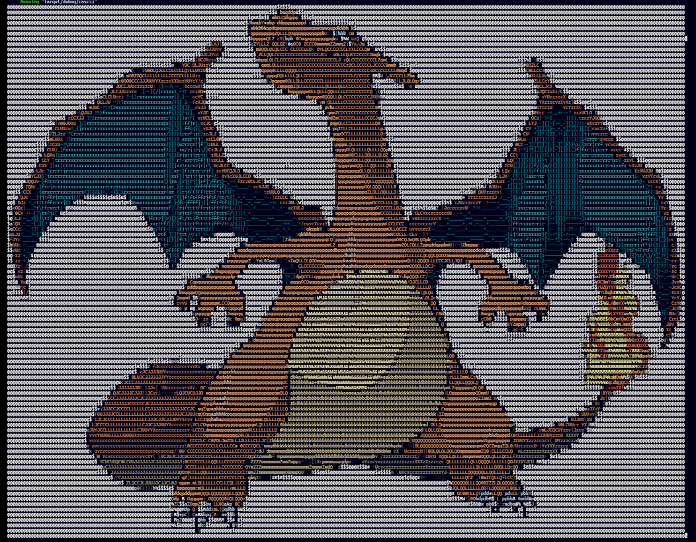

# Process image into colored ascii image

# Usage

- Render to stdout

```rust
use rascii::image_proc::ImageEngine;
use std::error::Error;
use std::io::stdout;

fn main() -> Result<(), Box<dyn Error>> {
    let source = image::open("charizard.png")?;
    let engine = ImageEngine::new(source);

    let mut writer = stdout();

    engine.render_to_text(&mut writer, 0, Some(256), None)?;
    Ok(())
}
```


- Write into a file

```rust

use rustascii::{image_proc::ImageEngine};
use std::{error::Error, io::stdout};
   
fn main() -> Result<(), Box<dyn Error>> {
    let source = include_bytes!("charizard");
    let engine = ImageEngine::from_slice(source)?;
    
   let mut file_writer = fs::File::create_new("your-new-file")?;
    
    // If only one of the axis is set,
    // the image aspect ratio will be preserved
    engine.render_to_text(&mut file_writer, 0, Some(128), None)?;
    Ok(())
}
```

## CLI
- CLI version is availabe on `cargo`
- Install the cli by
`
    cargo install rascii-cli
`
- And run `rascii-cli --help` on how to use the CLI

# Demo
- Origin 


- Rendered
- 
